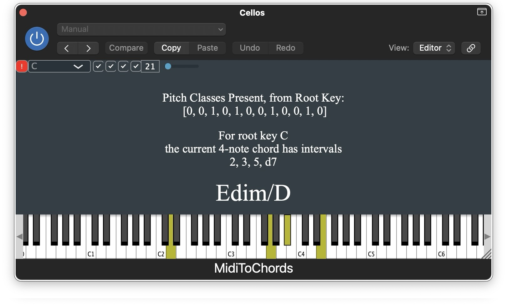

# MidiToChords

A JUCE-based AU/Standalone MIDI plugin that displays chord names from MIDI input in real-time.



## Features

- **Comprehensive chord recognition** - 60+ chord types: triads, 7ths, 9ths, 11ths, 13ths, altered, add chords
- **Automatic root detection** - Tries all 12 pitch classes to find the best match
- **Inversion detection** - Slash chord notation from actual bass note (e.g., C/E)
- **Visual keyboard** - Displays currently held notes
- **Interval display** - Shows intervals from the root key
- **Toggleable sections** - Show/hide keyboard, pitch classes, intervals, chord name

## Building

Requires CMake 3.16+ and a C++17 compiler. macOS 11+ for AU support.

**1. Get JUCE** (not included — supply your own copy):

```bash
# Either clone it:
git clone https://github.com/juce-framework/JUCE.git

# Or symlink an existing checkout:
ln -s /path/to/your/JUCE .
```

**2. Build:**

```bash
cmake -B build
cmake --build build
```

Output:
- `build/MidiToChords_artefacts/Standalone/MidiToChords.app`
- `build/MidiToChords_artefacts/AU/MidiToChords.component`

The AU plugin is automatically installed to `~/Library/Audio/Plug-Ins/Components/`.

## Usage

1. **Standalone**: Run `MidiToChords.app` and select your MIDI input device
2. **AU Plugin**: Load `MidiToChords.component` as a MIDI effect in your DAW (Logic Pro, GarageBand, etc.)

## License

This project uses [JUCE](https://juce.com/), which has its own licensing terms.

## Author

Julius O. Smith III - [CCRMA, Stanford University](https://ccrma.stanford.edu/~jos/)
